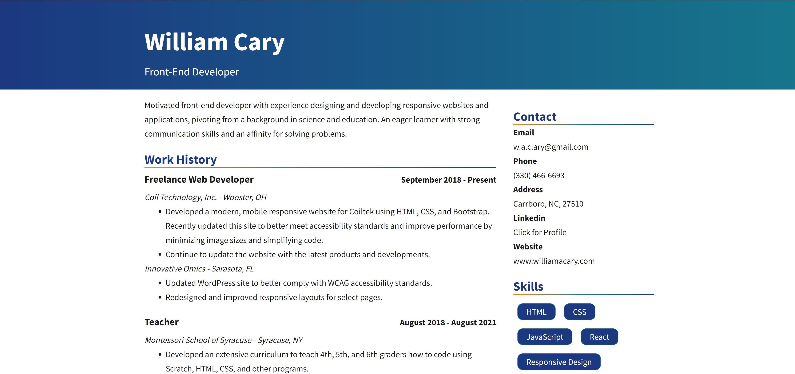
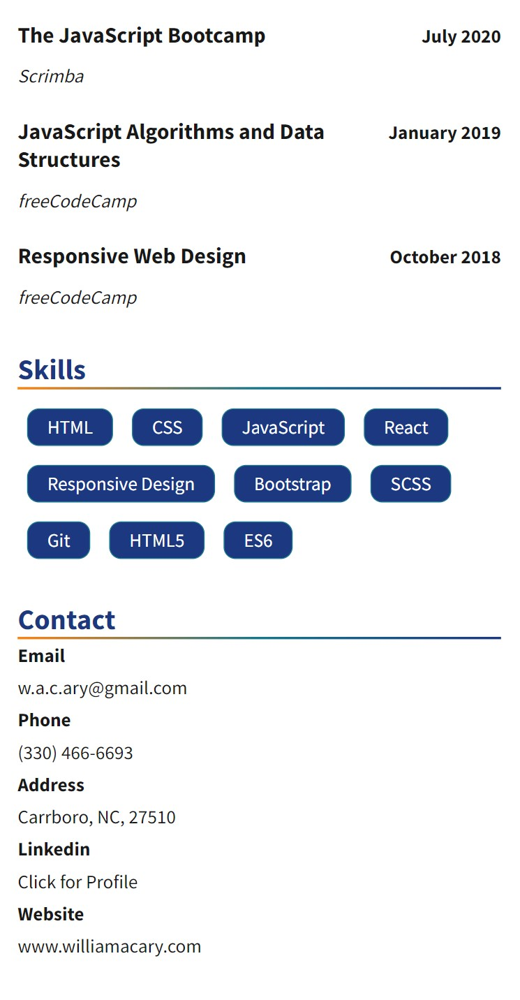

# Responsive Resume - Will Cary

Will Cary's Resume, built to be a responsive site with React and SCSS. Uses SCSS mixins for the design containers as well as SCSS for variables and nesting.

View live [here](https://williamacary-resume.netlify.app/).

## Displays
### Desktop

Example of the resume shown on a destop display, with the contact and skills sections placed to the right side.

### Mobile

Example of the resume shown on a mobile device, with the aside element (contact and skills sections) displaying at the bottom of the page.

## Technologies

- [SCSS](https://sass-lang.com/)
- [React](https://reactjs.org/)
- [Create React App](https://github.com/facebook/create-react-app)
